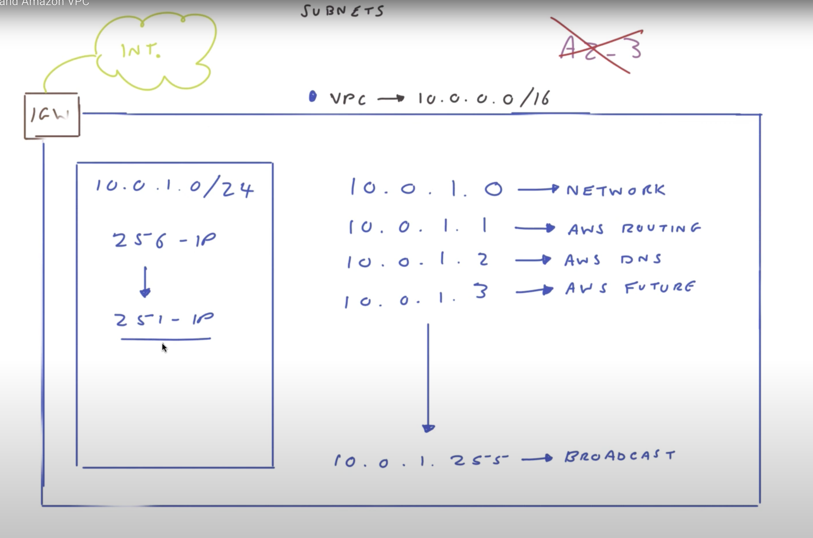
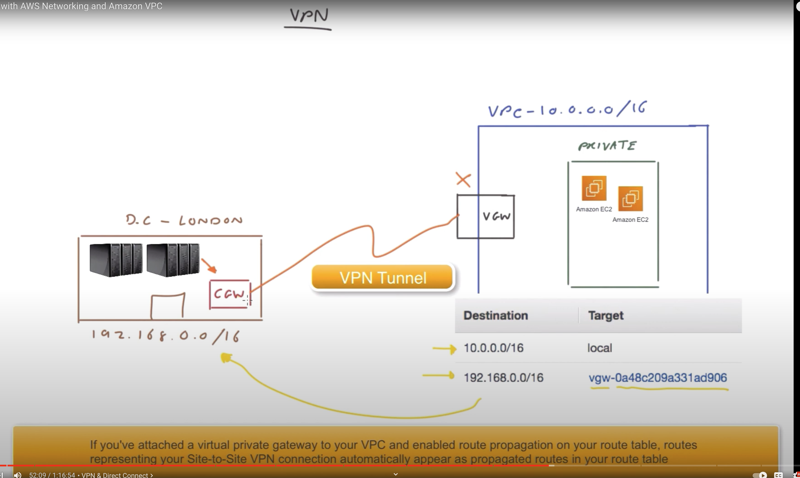

## AWS

### VPC
Like vm separate private cloud

### Subnet
Segment of VPC CIDR block forming smaller network segments

#### IGW: 
- Attached to VPC to connect to outside world
#### Routing tables: 
- Table consists of destination and target
- Every RT has local for comms between the subnets of a VPC
- For public subnet
  - Destination: 0.0.0.0/0
  - Target: igw-21268345
- Every subnet is private by default unless IGW is the target

### NACL
- By default all traffic denied
- Ingress
- Egress

### SG
- Applied to instance level for what is allowed and what is not

### NATG
- Gateway to access internet from private subnet
- Only accepts request initiated from within the vpc
- Denies all request from internet

### Bastion
- ssh to public subnet ec2
    - ec2 - sg 
      - type: ssh
      - protocol: tcp
      - port: 22
      - source 10.0.0.8
- ec2 in private subnet
    - sg 
      - type: ssh
      - protocol: tcp
      - port: 22
      - source: sg-987
- ssh agent forwarding

### VPN
- Connection between vpc & onprem, done through VPN tunnel
- VPN tunnel can only be initiated by CGW
- In aws create vgw
  - Routing tables
    - dest: 192.168.0.0/16
    - target: vgw-232
- Onprem cgw

### Direct Connect
- Isolated infrastructure not internet
- For connection between DC and AWS

### VPC Peering
- 2 different VPC in different regions
- vpc is 1:1, can't have multi
    - vpc1: 10.0.0.1/16
        - RT
          - destination: 172.31.0.0./16
          - target: pcx-232 (pairing connection)

### Transit Gateway
- Simplifies multi vpc, dc connection with central hub
- Every vpc connect to TGW

### Glossary
* CGW: Customer gateway
* DC : Data centers
* IGW: Internet gateway
* NACL: Network access control layer
* NATG: Network access transit gateway
* PCX: Peering connection
* SG: Security group
* TGW: Transit gateway
* VPC: Virtual private cloud
* VPG: Virtual private gateway
* VPN: Virtual private network

### Reference
https://www.youtube.com/watch?v=rg2BTWVCQlY&t=1s
